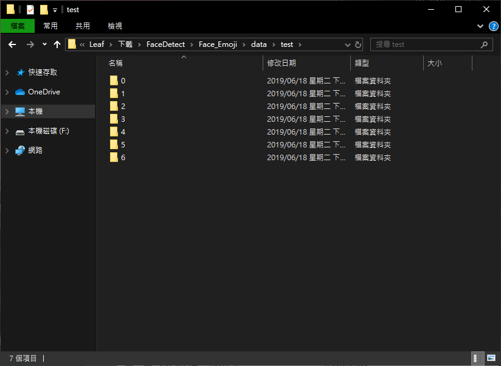
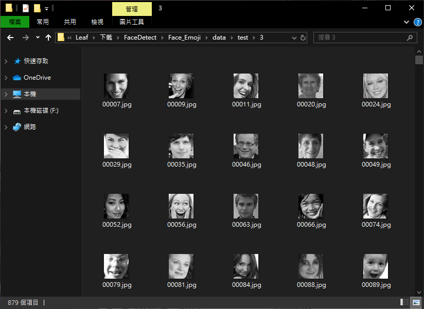
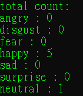

# 多媒體系統 期末專案

# Face_Emoji

  可以辨識照片/攝影機中的人臉部表情
  - 利用 OpenCV 函式庫識別人臉

  - fer2013資料集訓練神經網路的模型識別人臉表情

  - 使用訓練好的模型識別人臉的表情情緒

  - 根據識別結果，匹配合適的emoji遮住人臉，並儲存照片

## 安裝內容:
  * python
    - keras
    - tensorflow
  * opencv

## 使用說明
  安裝Python後
  >python predict.py [無引數為切換攝像頭模式]

  >python predict.py <圖片>

## 參考資料:
    原作者:
    [Github](https://github.com/zhouzaihang/FaceEmotionClassifier)

## 利用資料介紹

### FER2013

訓練模型的資料集選用了[kaggle](https://www.kaggle.com/c/challenges-in-representation-learning-facial-expression-recognition-challenge/data)挑戰賽上的fer2013資料集

下載得到的csv格式可以通過Excel看到格式為：

| Emotion | Pixels | Usage |

所以首先打開csv檔，根據usage把資料集分為：訓練集、測試集和驗證集，寫成Python Code 如以下:

``` python
    with open(csv_file) as f:
    csv_r = csv.reader(f)
    header = next(csv_r) #Python中讀取檔，指向的是檔的第一行，但是第一行是標題，所以用next()指向下一行，也就是從第二行開始
    print(header)
    rows = [row for row in csv_r]

    trn = [row[:-1] for row in rows if row[-1] == 'Training']
    csv.writer(open(train_csv, 'w+'), lineterminator='\n').writerows([header[:-1]] + trn)
    print(len(trn))

    val = [row[:-1] for row in rows if row[-1] == 'PublicTest']
    csv.writer(open(val_csv, 'w+'), lineterminator='\n').writerows([header[:-1]] + val)
    print(len(val))

    tst = [row[:-1] for row in rows if row[-1] == 'PrivateTest']
    csv.writer(open(test_csv, 'w+'), lineterminator='\n').writerows([header[:-1]] + tst)
    print(len(tst))
```

分為7個資料夾(0-6)分別作訓練，依序為:
    - 生氣(angry)
    - 厭惡(disgust)
    - 恐懼(fear)
    - 開心(happy)
    - 難過(sad)
    - 驚訝(surprise)
    - 平凡無表情(neutral)



``` python
    num = 1
    with open(csv_file) as f:
        csv_r = csv.reader(f)
        header = next(csv_r)
        for i, (label, pixel) in enumerate(csv_r):
            # 0 - 6 資料夾內的圖片label分別為：
            # angry ，disgust ，fear ，happy ，sad ，surprise ，neutral
            pixel = np.asarray([float(p) for p in pixel.split()]).reshape(48, 48)
            sub_folder = os.path.join(save_path, label)
            if not os.path.exists(sub_folder):
                os.makedirs(sub_folder)
            im = Image.fromarray(pixel).convert('L')
            image_name = os.path.join(sub_folder, '{:05d}.jpg'.format(i))
            print(image_name)
            im.save(image_name)
```

並把圖片做成灰階(Gray):


### Emoji表情集

替代人臉的卡通表情採用了iOS的Emoji


## 神經網路模型

### 構建模型

這裡用到了很多神經網路層

> 這裡圖像使用tf（tensorflow）順序，它在三個通道上的形狀為（48,48），正常圖片可以表示為(48, 48, 3)

> 灰階圖片一個通道

#### CNN(Convolutional Neural Network)
使用keras二維濾波器，輸出維度是32並且每個二維濾波器是1 * 1的卷積層

``` python
self.model.add(Conv2D(32, (1, 1), strides=1, padding='same', input_shape=(img_size, img_size, 1)))
```

padding='same'表示保留邊界處的卷積計算結果。總共只有兩種設置，這種表示輸出和輸入的大小相同，輸入的區域邊界填充為0；
padding='valid'表示只對輸入和濾波器完全疊加的部分做卷積運算，因而輸出將會少於輸入。不過講道理，這裡strides這個處理步幅已經是1了，不管設置什麼都不會超過邊界

使用ReLU激發函數

``` python
self.model.add(Activation('relu'))
```

然後給網路學習32個5 * 5的濾波器，也用ReLU啟動。並且緊接著一個最大池化層方法

``` python
self.model.add(Conv2D(32, (5, 5), padding='same'))
self.model.add(Activation('relu'))
self.model.add(MaxPooling2D(pool_size=(2, 2)))
```

之後第二層卷積階段和第三層卷積階段都是用ReLU啟動函數，後面再次跟著最大池化層方法。第二層仍然是32個3 * 3大小的濾波器，第三層濾波器增加到64個5 * 5，在更深的網路層增加濾波器數目是深度學習中一個普遍採用的技術

``` python
self.model.add(Conv2D(32, (3, 3), padding='same'))
self.model.add(Activation('relu'))
self.model.add(MaxPooling2D(pool_size=(2, 2)))

self.model.add(Conv2D(64, (5, 5), padding='same'))
self.model.add(Activation('relu'))
self.model.add(MaxPooling2D(pool_size=(2, 2)))
```

#### 深度管道的下一個階段

首先用Flatten()獲得一個扁平的網路

``` python
self.model.add(Flatten())
```

用ReLU啟動一個有2048個神經元的隱藏層，用Dropout丟棄到一半的網路，再添加一個1024個神經元的隱藏層，跟著一個關閉50%神經元的dropout層

``` python
self.model.add(Activation('relu'))
self.model.add(Dropout(0.5))
self.model.add(Dense(1024))
self.model.add(Activation('relu'))
self.model.add(Dropout(0.5))
```

#### 輸出層

添加作為輸出7個類的softmax層，每個類對應一個類別

``` python
self.model.add(Dense(num_classes))
self.model.add(Activation('softmax'))
```

#### MODEL_SUMMARY

``` python
_________________________________________________________________
Layer (type)                 Output Shape              Param #
=================================================================
conv2d_1 (Conv2D)            (None, 48, 48, 32)        64
_________________________________________________________________
activation_1 (Activation)    (None, 48, 48, 32)        0
_________________________________________________________________
conv2d_2 (Conv2D)            (None, 48, 48, 32)        25632
_________________________________________________________________
activation_2 (Activation)    (None, 48, 48, 32)        0
_________________________________________________________________
max_pooling2d_1 (MaxPooling2 (None, 24, 24, 32)        0
_________________________________________________________________
conv2d_3 (Conv2D)            (None, 24, 24, 32)        9248
_________________________________________________________________
activation_3 (Activation)    (None, 24, 24, 32)        0
_________________________________________________________________
max_pooling2d_2 (MaxPooling2 (None, 12, 12, 32)        0
_________________________________________________________________
conv2d_4 (Conv2D)            (None, 12, 12, 64)        51264
_________________________________________________________________
activation_4 (Activation)    (None, 12, 12, 64)        0
_________________________________________________________________
max_pooling2d_3 (MaxPooling2 (None, 6, 6, 64)          0
_________________________________________________________________
flatten_1 (Flatten)          (None, 2304)              0
_________________________________________________________________
dense_1 (Dense)              (None, 2048)              4720640
_________________________________________________________________
activation_5 (Activation)    (None, 2048)              0
_________________________________________________________________
dropout_1 (Dropout)          (None, 2048)              0
_________________________________________________________________
dense_2 (Dense)              (None, 1024)              2098176
_________________________________________________________________
activation_6 (Activation)    (None, 1024)              0
_________________________________________________________________
dropout_2 (Dropout)          (None, 1024)              0
_________________________________________________________________
dense_3 (Dense)              (None, 7)                 7175
_________________________________________________________________
activation_7 (Activation)    (None, 7)                 0
=================================================================
Total params: 6,912,199
Trainable params: 6,912,199
Non-trainable params: 0
_________________________________________________________________
model built
Found 28709 images belonging to 7 classes.
```

### 訓練模型

#### 編譯模型

這裡選擇隨機梯度下降演算法作為優化器

``` python
sgd = SGD(lr=0.01, decay=1e-6, momentum=0.9, nesterov=True)
self.model.compile(loss='categorical_crossentropy', optimizer=sgd, metrics=['accuracy'])
```

#### 通過資料增加改善性能

通常提高性能有兩種方法，一種是定義一個更深、有更多卷積操作的網路，另一種訓練更多的圖片。

這裡用keras自帶的ImageDataGenerator方法擴展資料集

``` python
# 自動擴充訓練樣本
train_datagen = ImageDataGenerator(
    rescale=1. / 255, # 歸一化處理
    shear_range=0.2, # 隨機縮放
    zoom_range=0.2, # 放大
    horizontal_flip=True) # 隨機水準翻轉
```

考慮到效率問題，keras提供了生成器針對模型的併發運行。我的理解就是CPU處理生成圖像，GPU上並行進行訓練

``` python
# 歸一化驗證集
val_datagen = ImageDataGenerator(rescale=1. / 255)
eval_datagen = ImageDataGenerator(rescale=1. / 255)
# 以檔分類名劃分label
train_generator = train_datagen.flow_from_directory(
    data_path + '/train',
    target_size=(img_size, img_size),
    color_mode='grayscale',
    batch_size=batch_siz,
    class_mode='categorical')
val_generator = val_datagen.flow_from_directory(
    data_path + '/val',
    target_size=(img_size, img_size),
    color_mode='grayscale',
    batch_size=batch_siz,
    class_mode='categorical')
eval_generator = eval_datagen.flow_from_directory(
    data_path + '/test',
    target_size=(img_size, img_size),
    color_mode='grayscale',
    batch_size=batch_siz,
    class_mode='categorical')
history_fit = self.model.fit_generator(
    train_generator,
    steps_per_epoch=800 / (batch_siz / 32),  # 28709
    nb_epoch=nb_epoch,
    validation_data=val_generator,
    validation_steps=2000,
)
```

#### 保存模型結構及權重

把結構保存為JSON字串，把權重保存到HDF5檔

``` python
model_json = self.model.to_json()
with open(model_path + "/model_json.json", "w") as json_file:
    json_file.write(model_json)
self.model.save_weights(model_path + '/model_weight.h5')
self.model.save(model_path + '/model.h5')
```

## 識別模組

### 載入權重及模型結構

``` python
# 從json中載入模型
json_file = open(model_path + 'model_json.json')
loaded_model_json = json_file.read()
json_file.close()
model = model_from_json(loaded_model_json)

# 載入模型權重
model.load_weights(model_path + 'model_weight.h5')
```

### 使用OPENCV-PYTHON識別人臉

用opencv打開攝像頭，使用opencv提供的一個訓練好的模型識別人臉人類器

WebCam:

``` python
# 創建VideoCapture對象
capture = cv2.VideoCapture(0)

# 使用opencv的人臉分類器
cascade = cv2.CascadeClassifier(model_path + 'haarcascade_frontalface_alt.xml')

# 即時獲得攝像頭資料
ret, frame = capture.read()

# 灰度化處理
    gray = cv2.cvtColor(frame, cv2.COLOR_BGR2GRAY)

# 識別人臉位置
faceLands = cascade.detectMultiScale(gray, scaleFactor=1.1,
                                        minNeighbors=1, minSize=(120, 120))
```

純圖片:
``` python
# 讀取圖片 名稱為img_name
img = cv2.imread(img_name)

#將圖片轉成灰階
gray = cv2.cvtColor(img, cv2.COLOR_BGR2GRAY)

# 使用opencv的人臉分類器
cascade = cv2.CascadeClassifier(model_path + 'haarcascade_frontalface_alt.xml')

#識別人臉位置(無最小大小)
faceLands = cascade.detectMultiScale(gray, scaleFactor=1.1,minNeighbors=1)
```

### 識別人臉情緒

根據識別出的臉部特徵點，裁剪出臉部圖像，然後調用模型預測情緒

``` python
if len(faceLands) > 0:
    for faceLand in faceLands:
        x, y, w, h = faceLand
        images = []
        result = np.array([0.0] * num_class)

        # 裁剪出臉部圖像
        image = cv2.resize(gray[y:y + h, x:x + w], (img_size, img_size))
        image = image / 255.0
        image = image.reshape(1, img_size, img_size, 1)

        # 調用模型預測情緒
        predict_lists = model.predict_proba(image, batch_size=32, verbose=1)
        result += np.array([predict for predict_list in predict_lists
                            for predict in predict_list])
        emotion = emotion_labels[int(np.argmax(result))]
        print("Emotion:", emotion)
```

根據識別結果，用cv的rectangle在視頻流上框出臉部並且用putText打上標籤

``` python
# 框出臉部並且寫上標籤
# 圖片/起點座標/對向座標/顏色/粗細
cv2.rectangle(frame, (x - 20, y - 20), (x + w + 20, y + h + 20),
                (0, 255, 255), thickness=10)
# putText(Mat& img, const string& text, Point org, int fontFace, double fontScale,
#         Scalar color, int thickness=1, int lineType=8, bool bottomLeftOrigin=false)
# 照片/添加的文字/左上角坐標/字體/字體大小/顏色/字體粗細
cv2.putText(frame, '%s' % emotion, (x, y - 50),
            cv2.FONT_HERSHEY_DUPLEX, 2, (255, 255, 255), 2, 30)
cv2.imshow('Face', frame)
```

### 用EMOJI蓋住人臉

先在第一次獲取視頻畫面的時候就copy一個沒有灰度化處理的視頻畫面

``` python
# 呈現用emoji替代後的畫面
    emoji_show = frame.copy()
```

直接把emoji圖片遮蓋人臉會出現emoji背景變為黑色蓋上去了。所以這裡要蒙版處理一下，也就是保持emoji透明背景的特性，當然，這裡所有圖像都要歸一化處理

``` python
def face2emoji(face, emotion_index, position):
    x, y, w, h = position
    emotion_image = cv2.resize(emotion_images[emotion_index], (w, h))
    overlay_img = emotion_image[:, :, :3]/255.0
    overlay_bg = emotion_image[:, :, 3:]/255.0
    background = (1.0 - overlay_bg)
    face_part = (face[y:y + h, x:x + w]/255.0) * background
    overlay_part = overlay_img * overlay_bg

    face[y:y + h, x:x + w] = cv2.addWeighted(face_part, 255.0, overlay_part, 255.0, 0.0)

    return face
```
### 最後結果


